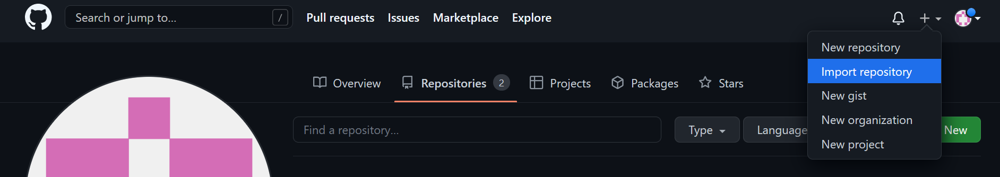
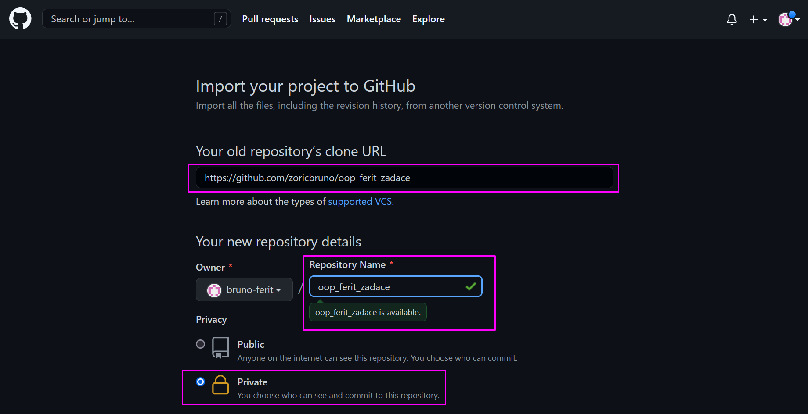
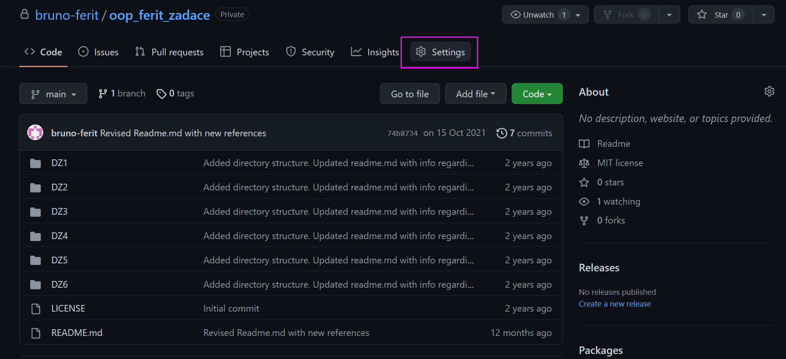

# OOP FERIT Zadaće

Početni projekt za rješavanje domaćih zadaća na kolegiju Objektno orijentirano progamiranje na FERIT-u.

## Git

Git je besplatan alat otvorenog koda namijenjen distribuiranom upravljanju verzijama izvornog koda. Danas je on standard i podrazumijeva se barem osnovno poznavanje rada s gitom (ili, eventualno, drugim sličnim sustavom) u svim razvojnim timovima na projektima svih veličina. 

Kako biste započeli raditi s gitom, potrebno ga je preuzeti i instalirati. To je moguće napraviti na: [Git preuzimanje](https://www.git-scm.com). Iako ga je moguće koristiti i kroz grafičko sučelje, pune mogućnosti i dublje razumijevanje u svakom se slučaju dobivaju njegovom uporabom kroz konzolu. Na windowsima uz instalaciju gita dolazi mogućnost instalacije _git_ _bash_ alata (_shella_) što je svakako preporučeno. Također, zgodno je dodati git bash u kontekstualni izbornik prilikom instalacije kako bi se on pokretao odmah u željenom direktoriju. Nakon instalacije gita, potrebno je podesiti korisničko ime i e-mail adresu, a to se postiže naredbama
```
git config --global user.name "YOUR_USERNAME"
git config --global user.email "your_email_address@example.com"
```

## Osnove gita

Git je moguće rabiti odmah nakon instalacije, a jednostavne upute moguće je pronaći (s obzirom da će se kasnije rabiti Github) na [Git basics](https://www.freecodecamp.org/news/learn-the-basics-of-git-in-under-10-minutes-da548267cc91/). Osim ovoga, dobar resurs predstavlja i knjiga [Pro git](https://git-scm.com/book/en/v2). Video vodič kolege Leventića dostupan je na [Git video vodič](https://www.youtube.com/watch?v=a0fgOeEpE74&list=PLDKea8VEeLQNtn__lG_TDqwhlGhoutWym).

Kako biste testirali instalaciju i upoznali se s gitom, kreirajte prazan direktorij naziva "Projekt", navigirajte u netom kreiran direktorij kroz _git_ _bash_(a ako ste dodali _git_ _bash_ u kontekstualni izbornik onda možete desnom tipkom direktno iz direktorija pokrenuti _git_ _bash_) i u njemu korištenjem 
```
git init
```
inicijalizirajte prazan repozitorij. Zatim, korištenjem
```
git status
```
provjerite trenutno stanje repozitorija. Trebao bi biti prazan. Ako ga otvorite u file exploreru s uključenim prikazom skrivenih datoteka, onda bi trebao biti vidljiv samo skriveni direktorij .git. U direktoriju "Projekt" kreirajte tekstualnu datoteku "info.txt" s vlastitim imenom i prezimenom zapisanim unutra. Nakon toga, provjerite stanje repozitorija.

Git prati stanje svih datoteka u direktoriju koje nisu ignorirane. Crvenom bojom teksta označene su datoteke koje su izmijenjene (dodane, obrisane, promijenjenog sadržaja). Ono što git omogućuje je kreiranje slike (_snapshota_) cjelokupnog sadržaja direktorija i njene pohrane (stvara se točka u vremenu na koju se moguće vratiti). Da bi točka mogla biti stvorena, datoteke je potrebno dodati u tzv. _staging_ područje. Ovo se postiže naredbom
```
git add --all
git status
```

Kada su željene datoteke dodane u _staging_ područje, moguće je snimiti sliku naredbom 

```
git commit -m "Initial commit. Added info.txt"
git status
```

Oznaka -m govori da će uz tu sliku biti naveden i opis koji slijedi iza nje. Ovo je jako korisno jer će olakšati kasnije baratanje slikama. Poruke uvijek trebaju biti smislene!

Kada je slika snimljena, na nju se moguće vratiti bilo kada u kasnijem razvoju programa (postoji i još puno drugih mogućnosti). Da bi se vidjele sve slike moguće je koristiti naredbu

```
git log
```


## Github

Iako je i kada se rabi lokalno riječ o alatu s brojnim mogućnostima, git omogućuje podizanje lokalnog repozitorija na udaljene repozitorije. Github je on-line servis koji omogućuje pohranu repozitorija online i lako upravljanje projektima, a bit će korišten za ove vježbe jer besplatno omogućuje privatne projekte.

Kako bi se mogao koristiti, potrebno je najprije besplatno kreirati račun na [Githubu](www.github.com). 

U ovom trenutku, za probu, pokušajte repozitorij kreiran u prošlom koraku podići na Github u prazan projekt koji ste ondje kreirali. Za pomoć se moguće koristiti [upute](https://www.techrepublic.com/article/how-to-push-a-new-project-to-github/).

## Korištenje projekta

Za rješavanje zadaća napravite uvoz (_import_) ovog repozitorija [(ovaj koji trenutno gledate, kliknite ovdje na link ako ne znate što sad)](https://github.com/zoricbruno/oop_ferit_zadace). Ovo postižete tako što se prijavite na svoj Github račun i u gornjem desnom kutu kliknete na ikonu +. Tada odabirete import repository, kako je prikazano slikom  . 

Na ekranu za postavke uvoza repozitorija trebate unijeti poveznicu do repozitorija koji uvozite, naziv za taj repozitorij na Vašem Githubu te postaviti vidljivost na privatnu (!!!), kako je prikazano slikom .

Pritiskom na gumb _Begin_ _import_ započet će uvoz repozitorija koji će, jednom kada uspješno završi, rezultirati privatnom kopijom početnog repozitorija na Vašem Githubu. S obzirom da je pristup privatnim repozitorijima moguć samo vlasniku i suradnicima, trebate me dodati kao suradnika na repozitorij. Ovo postižete tako da odete na stranicu repozitorija na Vašem Githubu. Ondje na vrhu odaberete opciju _Settings_ prema slici , a zatim opciju _Collaborators_ iz izbornika s lijeve strane, prema slici . Trebate dodati korisnika _bruno-ferit_. 


Nakon ovog postupka, projekt bi trebao postojati i na Vašem Github računu, ali kao privatan projekt. Tada ga je moguće lokalno klonirati i započeti s radom. Kada želite spremiti stanje projekta, to radite najprije dodavanjem svih promjena naredbom _add_ i zatim kreiranjem trenutne slike naredbom _commit_. Kada želite podići kod na svoj udaljeni repozitorij, to radite naredbom _push_. 

```
git push -u origin --all
```
Za slučaj da origin ne postoji, morate dodati link do svog repozitorija (možete ga kopirati s githuba, sa stranice projekta) korištenjem naredbi
```
git remote add origin "LINK_KOJI_STE_KOPIRALI"
```
i nakon toga napraviti _push_.

Predaja zadaće obavlja se postavljanjem poveznice (linka) do Vašeg repozitorija u zadaću otvorenu na Merlin stranici kolegija. Ovo je potrebno ponoviti za svaku zadaću na Merlinu, iako se poveznica do repozitorija naće mijenjati, jer se to smatra prijavom riješene zadaće.

*NAPOMENE:*
* Projekt koji kreirate na Githubu mora biti privatan. Javni projekti (repozitoriji) neće biti uvaženi. 
* Link na repozitorij zalijepit ćete na odgovarajuće mjesto na Merlin stranici kolegija za svaku zadaću koju rješavate.
* Predaja zadaće nakon isteka roka neće biti moguća.
* Arhivske datoteke postavljene izravno na Github neće biti razmatrane, nemojte arhivirati kod i postavljati ga tako.

